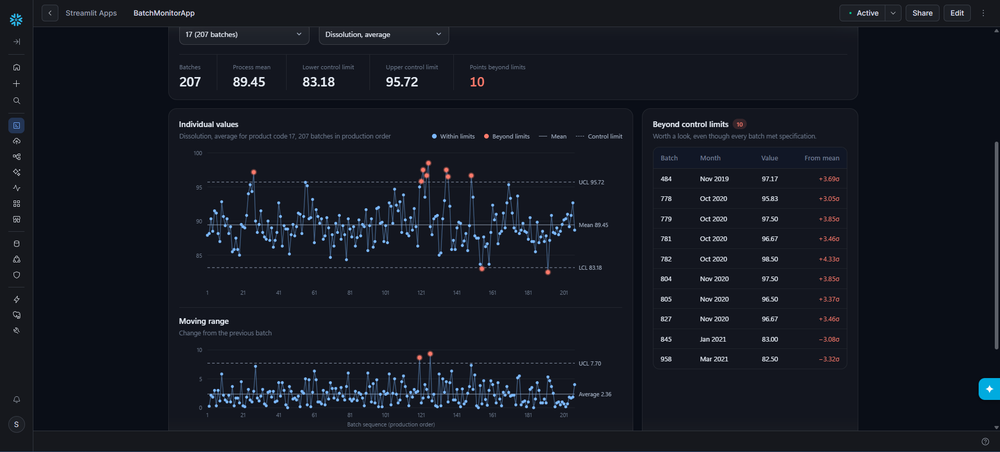
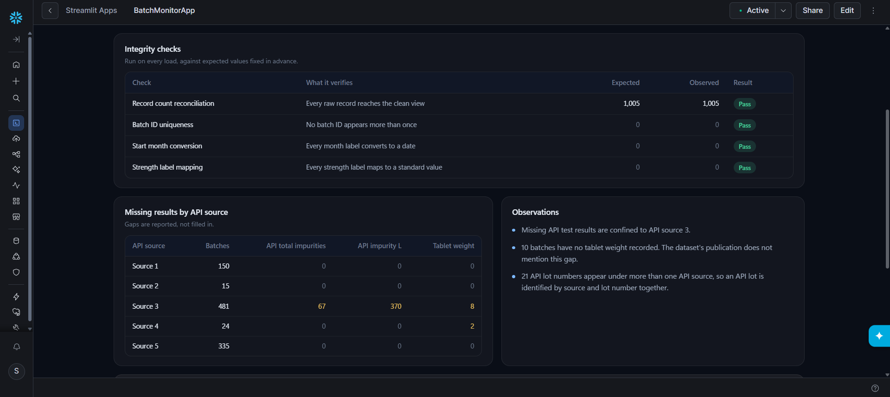
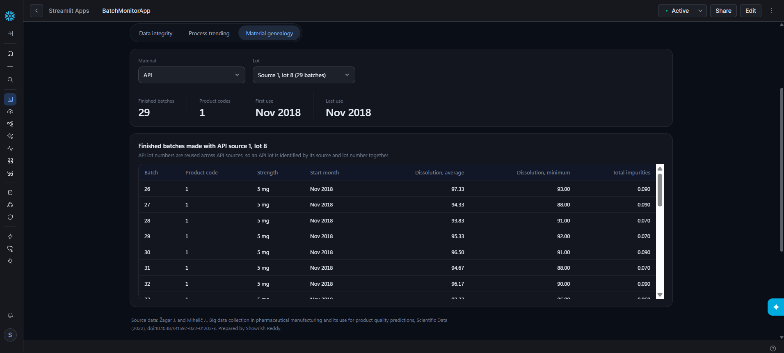

# Batch Monitor: Snowflake pipeline and Streamlit app for pharmaceutical batch data

A small, end-to-end data integrity project built in Snowflake on real, publicly released pharmaceutical
manufacturing data. It loads 1,005 production batches, preserves the source file untouched, cleans it in a
view, checks every step against expected values, and serves a Streamlit in Snowflake dashboard for
integrity checks, process trending and material genealogy.

> **Intended use:** demonstration only, on a public and anonymized dataset. This is not a validated system
> and must not be used for GMP decisions.

## Data

Laboratory data for 1,005 production batches of a film-coated tablet made by direct compression,
Nov 2018 to Apr 2021, across 25 product codes. Each row is one finished batch, with its raw material
lots (genealogy), incoming material tests, in-process tablet checks and final product quality results.

Source: Žagar J. and Mihelič J., *Big data collection in pharmaceutical manufacturing and its use for
product quality predictions*, Scientific Data (2022), [doi:10.1038/s41597-022-01203-x](https://doi.org/10.1038/s41597-022-01203-x).
The file is available from the [figshare collection](https://doi.org/10.6084/m9.figshare.c.5645578.v1)
and is not included in this repository.

## What profiling the file turned up

| Finding | Why it matters | How it is handled |
|---|---|---|
| Semicolon-delimited export | A default comma load fails | Explicit file format |
| Month labels in Slovenian (`maj`, `avg`, `okt`) | English date parsing breaks on May, Aug and Oct, or silently blanks them | Explicit month mapping |
| Missing values stored as runs of spaces as well as empty fields | Numeric loads reject the spaces | Trimmed, then treated as missing |
| Truncated strength labels (`5MG`, `10M`, `20M`, `40M`) | Inconsistent grouping | Mapped to standard labels |
| 10 batches with no tablet weight | Not mentioned in the dataset's publication | Reported as a known gap |
| 21 API lot numbers reused across API sources, with different test results | Tracing by lot number alone mixes unrelated lots | API lots keyed on source plus lot number |
| Up to 87% of some impurity results exactly 0.050 | Likely a reporting limit, which makes control limits unreliable | The app warns when this applies |

## Pipeline

1. **Source file received:** `Laboratory.csv` uploaded to an internal stage.
2. **Landed unchanged:** `RAW.LAB_RESULTS_RAW`, every column stored as text, loaded with `COPY INTO`
   after a dry run (`VALIDATION_MODE`), all or nothing (`ON_ERROR = ABORT_STATEMENT`).
3. **Typed and standardized:** the view `CLEAN.LAB_RESULTS`. Strict conversion (`TO_DOUBLE`) turns blanks into
   missing values and fails loudly on anything else. The raw table is never edited.
4. **Reviewed:** a read-only Streamlit in Snowflake app.

Every step ends with checks against expected values, and the final numbers match an independent pandas
calculation (`verify_profile.py`).

## The app

* **Data integrity:** record count reconciliation, batch ID uniqueness, date and label conversion,
  missing results by API source, observations and data lineage.
* **Process trending:** an individuals and moving range (I-MR) chart per product code and quality attribute,
  with points beyond the control limits flagged for review. Limits are the mean ± 3σ, with σ estimated as the
  average moving range divided by 1.128. Control limits are not specification limits.
* **Material genealogy:** every finished batch made with a chosen raw material lot.

The dashboard is custom HTML, CSS and JavaScript, fully inline because Streamlit in Snowflake blocks
external scripts, styles and fonts.

## Snowflake features exercised

Warehouses, stages, file formats, `COPY INTO` with validation mode, views, zero-copy cloning, Time Travel
(`BEFORE (STATEMENT => ...)` and `UNDROP`), a Data Metric Function for automatic duplicate checks, a
read-only role, and Streamlit in Snowflake.

## Reproduce it

1. Create a Snowflake account (Enterprise edition, needed for Data Metric Functions).
2. Run `sql/01_setup.sql`, then `sql/02_load.sql`, uploading `Laboratory.csv` to `LAB_STAGE` when prompted.
3. Run `sql/03_clean_view.sql` and compare the checks with their expected values.
4. Optionally run `sql/04_exercises.sql`.
5. Create a Streamlit app in `BATCH_MONITOR.CLEAN` on `PREP_WH` and paste in `app/batch_monitor_app.py`.

## Limitations

* Public, anonymized data. Batch and lot IDs are codes, not real identifiers.
* Oral solid dose tablets, not biologics.
* The source data has no specification limits, so capability indices are not calculated.
* Not a validated system.
